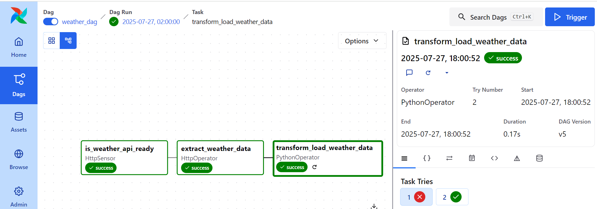
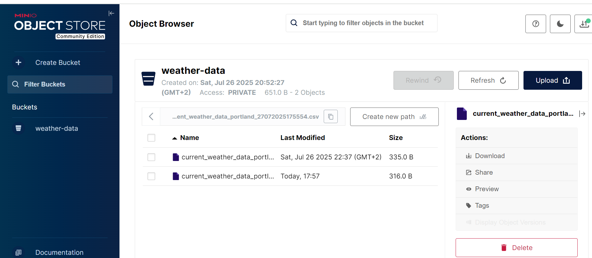

# Building an Airflow Weather Data Pipeline with MinIO Storage

## Project Overview

This project creates an automated data pipeline using Apache Airflow to retrieve real-time weather data for Portland, Oregon, from the OpenWeatherMap API, transform it into a structured format, and store it as CSV files in a MinIO bucket. The pipeline runs daily, leveraging Airflow's scheduling capabilities, and uses a temporary folder (`~/airflow/tmp`) to stage data before uploading it to MinIO. The setup spans a Windows machine running MinIO and an Ubuntu environment (via WSL) hosting Airflow, showcasing cross-platform integration.

### Objectives

- **Fetch Data**: Query the OpenWeatherMap API for Portland's weather.
- **Transform Data**: Convert temperatures from Kelvin to Fahrenheit and structure the data using Pandas.
- **Store Data**: Save the transformed data as CSV files in MinIO's `weatherapiairflowyoutubebucket-yml` bucket.
- **Automate**: Use Airflow to schedule and orchestrate the pipeline.

## Prerequisites

Before diving in, ensure you have:

- **Ubuntu** (via WSL or standalone): For running Airflow.
- **Windows**: For running MinIO server.
- **Python 3.10+**: With a virtual environment for Airflow.
- **Dependencies**: `apache-airflow`, `apache-airflow-providers-http`, `apache-airflow-providers-amazon`, `pandas`, `boto3`.
- **MinIO**: Installed on Windows with a bucket named `weatherapiairflowyoutubebucket-yml`.
- **OpenWeatherMap API Key**: Sign up at [openweathermap.org](https://openweathermap.org) to get an API key.

## Setup Instructions

### Step 1: Set Up Ubuntu Environment

1. **Install Ubuntu (if using WSL)**:
   ```bash
   wsl --install -d Ubuntu

## Set Up Ubuntu Environment

### Update Ubuntu and install dependencies
   ```bash
   sudo apt update
   sudo apt install python3-pip python3.10-venv
 ```
### Create Virtual Environment
```bash
python3 -m venv ~/airflow_venv
source ~/airflow_venv/bin/activate
```
# Airflow and MinIO Setup Guide

## Installation and Configuration

### Install Airflow and Dependencies
```bash
pip install apache-airflow \
    apache-airflow-providers-http \
    apache-airflow-providers-amazon \
    pandas \
    boto3
```
# Airflow and MinIO Setup Guide

## Initialize Airflow

```bash
airflow standalone
```
*   **Airflow UI**: [http://localhost:8080](http://localhost:8080/)
    
*   **Note**: Admin password will be displayed in the command output
    

MinIO Windows Setup
-------------------

### Download and Install MinIO

1.  Download minio.exe from [min.io](https://min.io/)
    
2.  Save to C:\\minio directory
    

### Start MinIO Server

   ```bash
   .\minio.exe server C:\minio\data --address ":9000" --console-address ":9001" --config-dir C:\minio\config   `
   ```
*   **API Endpoint**: http://192.168.1.78:9000 (or http://127.0.0.1:9000)
    
*   **Web Console**: http://192.168.1.78:9001
    
*   Username: minioadminPassword: minioadmin
    

### Create Storage Bucket

  ```bash
   mc alias set myminio http://192.168.1.78:9000 minioadmin minioadmin  mc mb myminio/weatherapiairflowyoutubebucket-yml   `
   ```
Airflow Configuration
---------------------

### Set Up Working Directory
```bash
mkdir -p ~/airflow/tmp  chmod 755 ~/airflow/tmp   `
```
### Configure API Connection

1.  Access the Airflow web interface at [http://localhost:8080](http://localhost:8080/)
    
2.  Navigate to: **Admin** → **Connections** → **Add new connection**
    
3.  textCopyDownloadConnection ID: weathermap\_apiConnection Type: HTTPHost: api.openweathermap.orgSchema: http
    

Pipeline Implementation
-----------------------

### DAG Functions (weather\_dag.py)

#### 1\. API Verification

*   Check OpenWeatherMap API status and availability
    

#### 2\. Data Acquisition

*   Retrieve current weather metrics from API
    

#### 3\. Data Transformation

*   Convert temperature from Kelvin to Fahrenheit
    
*   Structure dataset using Pandas DataFrame
    
*   Clean and validate data
    

#### 4\. Data Persistence

*   Stage processed data in ~/airflow/tmp
    
*   Archive final dataset to MinIO bucket
    
*   Verify successful upload


✅ Sample Output



